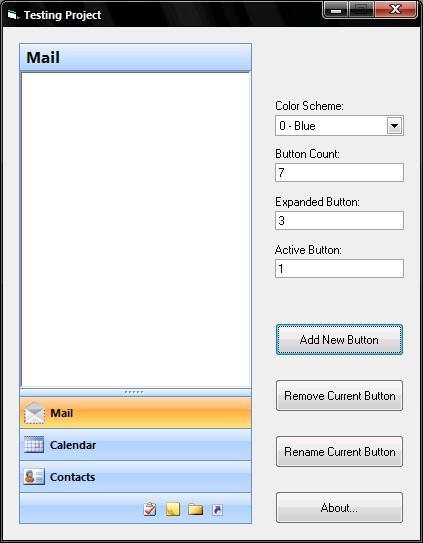



## Outlook 2K7 Navigation Pane \(Updated 12 Jan 08\)

### Description

This Control, will put a Outlook 2007 Navigation Pane to your application.
 
### More Info
 

             |
---                |---
**Submitted On**   |2008-01-11 20:07:20
**By**             |[Fauzie](https://github.com/Planet-Source-Code/PSCIndex/blob/master/ByAuthor/fauzie.md)
**Level**          |Intermediate
**User Rating**    |4.8 (29 globes from 6 users)
**Compatibility**  |VB 6\.0
**Category**       |[Custom Controls/ Forms/  Menus](https://github.com/Planet-Source-Code/PSCIndex/blob/master/ByCategory/custom-controls-forms-menus__1-4.md)
**World**          |[Visual Basic](https://github.com/Planet-Source-Code/PSCIndex/blob/master/ByWorld/visual-basic.md)
**Archive File**   |[Outlook\_2K2097081112008\.zip](https://github.com/Planet-Source-Code/fauzie-outlook-2k7-navigation-pane-updated-12-jan-08__1-69819/archive/master.zip)

